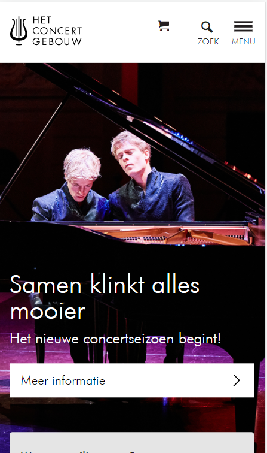
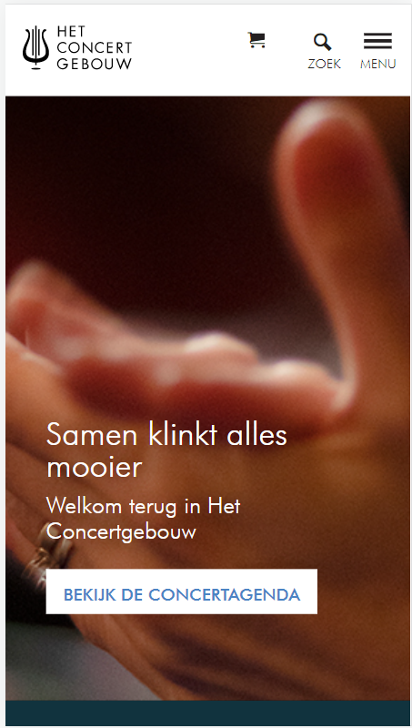
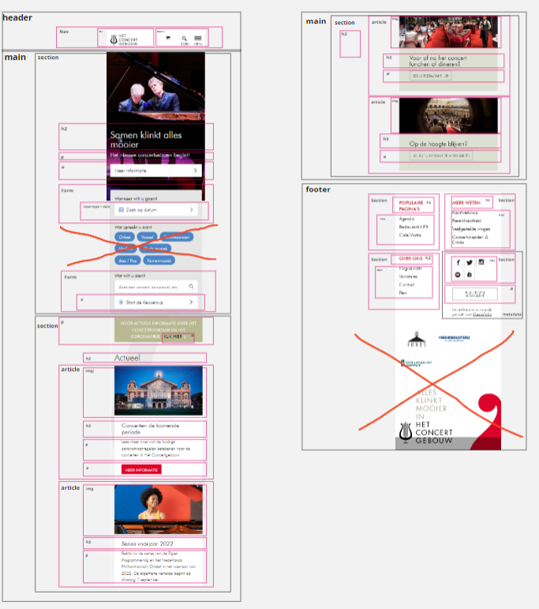
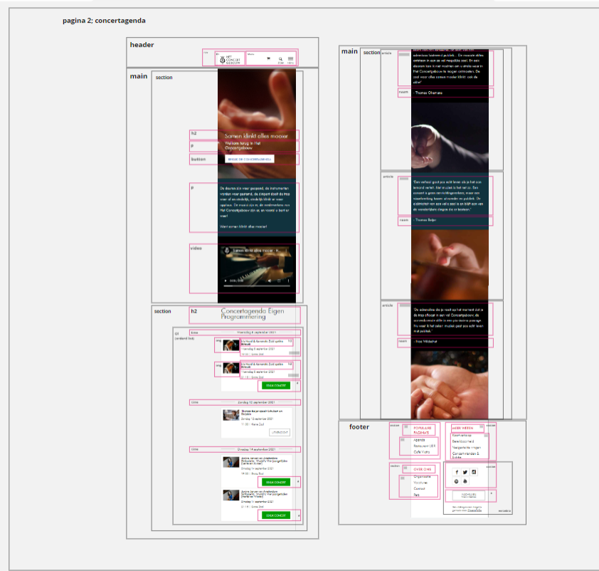
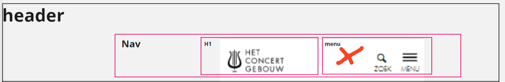
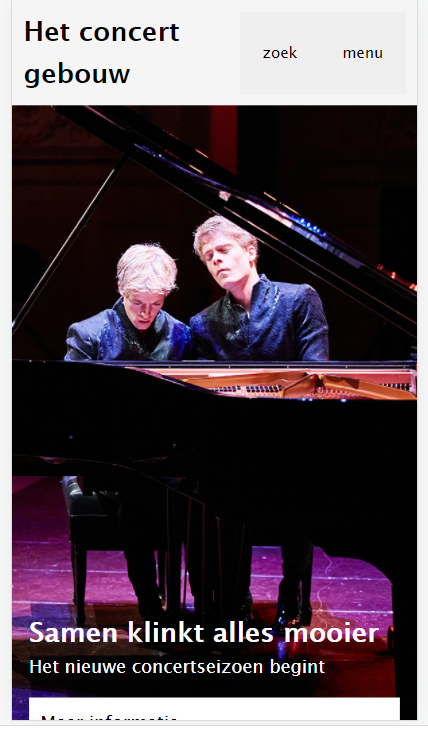
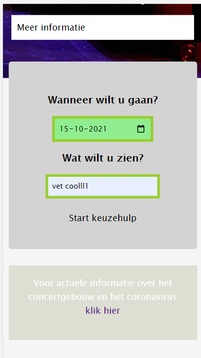
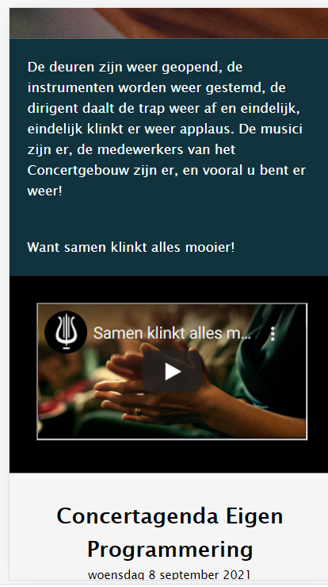

# Procesverslag
Markdown is een simpele manier om HTML te schrijven.  
Markdown cheat cheet: [Hulp bij het schrijven van Markdown](https://github.com/adam-p/markdown-here/wiki/Markdown-Cheatsheet).

Nb. De standaardstructuur en de spartaanse opmaak van de README.md zijn helemaal prima. Het gaat om de inhoud van je procesverslag. Besteedt de tijd voor pracht en praal aan je website.

Nb. Door *open* toe te voegen aan een *details* element kun je deze standaard open zetten. Fijn om dat steeds voor de relevante stuk(ken) te doen.

## Jij

uitwerken voor kick-off werkgroep

### Auteur:
Sterre Meijer

#### Je startniveau:
blauw

#### Je focus:
surface plane
 

## Je website

uitwerken voor kick-off werkgroep

### Je opdracht:
https://www.concertgebouw.nl/

#### Screenshot(s) van de eerste pagina (small screen): 
homescreen

#### Screenshot(s) van de tweede pagina (small screen):
ticketspage 

 

## Breakdownschets (week 1)

uitwerken na afloop 2e werkgroep link voor schetsen miro: https://miro.com/app/board/o9J_lySfeUw=/?invite_link_id=969260563827 

### de hele pagina: 

### dynamisch deel (bijv menu): 

## Voortgang 1 (week 2)

uitwerken voor 1e voortgang

### Stand van zaken
Ik vond de eerste opzet best lastig, maar zodra de basis stond ging ik best lekker.
Moeite met onthouden van alle elementen en opties (vooral in css)
Duurt allemaal wel best lang.

### Agenda voor meeting
samen met je groepje opstellen

| IK             | INE                | Mathijs      | Arsenio          |
| ---            | ---                | ---          | ---              |
| html semantisch| html semantisch    | div en class | html bekijken    |
|                |                    |              |                  |
|                | ...                | ...          | ...              |

### Verslag van meeting
hier na afloop snel de uitkomsten van de meeting vastleggen

- wanneer je iets gebruikt 
  alleen om het te flexen moet het wel een div zijn
- werk per blokje en wanneer je daar tevreden mee bent door 
- probeer aan het eind van volgende week helemaal bij te zijn dan gaat het lekker!

## Voortgang 2 (week 3)

uitwerken voor 2e voortgang

### Stand van zaken
Ik zat inmiddels iets meer in de flow van het code schrijven,
en het ging me dan ook iets makkelijker af dan vorige week alhoewel ik
nogsteeds wel moeite had met foutjes terug vinden of snappen
waarom bepaalde elementen nu op een bepaalde manier reageren.

### Agenda voor meeting
samen met je groepje opstellen

| IK             | INE                | Mathijs      | Arsenio          |
| ---            | ---                | ---          | ---              |
| menu           |responsive          | hoe nu verder| menu             |
| formulier blok |                    | div          |                  |
|                | ...                | ...          | ...              |

### Verslag van meeting
hier na afloop snel de uitkomsten van de meeting vastleggen

- Probeer niet te veel vast te zitten in alle details
- Gebruik handige tools voor makkelijker/ sneller coderen

## Toegankelijkheidstest (week 4)

uitwerken na test in 8e voortgang

### Bevindingen
Lijst met je bevindingen die in de test naar voren kwamen:
- labels blijven niet altijd zichtbaar/ de focusstate is niet altijd duidelijk genoeg
- Buttons kunnen groter, anders soms lastig om op te klikken
- kleurcontrast over het algemeen goed, maar het wit kan wegvallen tegen de foto's
- met blur effect/ weinig zicht moet je erg dicht op de webpagina gaan zitten
- de screenreader pakte nu niet alle linkjes omdat ze niet allemaal echt een link waren, maar werkte verder verbazingwekkend goed al op mijn eigen pagina.

#### Onduidelijke focuss
De focusstate was niet duidelijk genoeg (er was slechts een klein dun lijntje te zien)

Dit kan simpel worden opgelost door de lijn bijvoorbeeld dikker te maken 
en kleur toe te voegen aan de achtergrond van de focuss. 
Dit heb ik dan ook met mijn focussstate gedaan.

#### kleurcontrast soms te laag 
Wanneer mensen die kleurenblind zijn naar de witte tekst op 
bijvoorbeeld een afbeelding kijken kan deze een beetje wegvallen.

Dit valt simpel op te lossen door het kleurcontrast hoger te maken
of een kleurvlak over de afbeelding heen te zetten.

#### Weinig zicht maakt alles te klein
Mensen die geblurd zien moeten ercht dichtbij zitten

dit kan worden opgelost door de content groter te maken
of dit aanpasbaar te maken voor de gebruiker zelf

#### Screenreader afbeeldingen 
De screenreader pakt afbeeldingen niet zonder label 

makkelijke oplossing: afbeeldingen labelen

## Voortgang 3 (week 4)

uitwerken voor 3e voortgang

### Stand van zaken
Zat deze week beetje vast in css en moeite met het uitklap menu
De javascript werkte niet door een missende hoofdletter
echter verder wel prima, moet gewoon nog even hard doorwerken.
Interessant om te zien hoe lastig websites soms te gebruiken zijn voor mensen met beperkingen.

### Agenda voor meeting
samen met je groepje opstellen

| Ik             | INE                | Mathijs      | Arsuino          |
| ---            | ---                | ---          | ---              |
| html bekijken  | even alles         | even alles   | algemeen         |
| css bekijken   | doorlopen          | algemeen     | met tab knop     |
|                | ...                | doorlopen    | focuss states    |

### Verslag van meeting
hier na afloop snel de uitkomsten van de meeting vastleggen

- lijst dlo met verplichtingen
- easter eggs eventueel toevoegen ookal past het niet vollefig
- Hou het beoordelingsformulier er is naast

## Eindgesprek (week 5)

uitwerken voor eindgesprek

### Stand van zaken
De laatste week was nog best wel even stressen, en ik denk dat 
er nog genoeg dingen zijn op de website die beter kunnen. Maar al 
met al ben ik erg tevreden met mijn resultaat en de voortgang
die ik heb gemaakt in de afgelopen weken.

### Screenshot(s)

## Bronnenlijst

continu bijhouden terwijl je werkt

Nb. Wees specifiek ('css-tricks' als bron is bijv. niet specifiek genoeg).

1. https://www.w3schools.com/html/html_youtube.asp
2. https://www.digitalocean.com/community/tutorials/css-styling-form-input-validity

